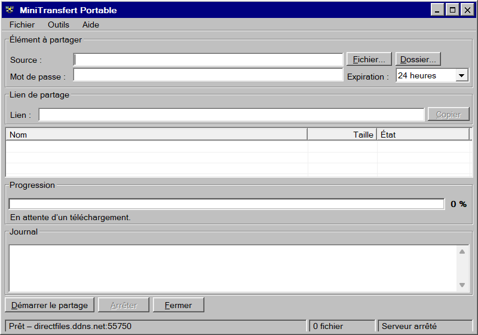

# MiniTransfert Portable

Un petit utilitaire Windows portable pour partager directement un fichier ou un dossier avec un proche, depuis une interface rétro inspirée de Windows 98/2000.



## Fonctionnalités

- un seul exécutable Windows x64, sans installation;
- partage d’un fichier ou de tout un dossier;
- lien unique à ouvrir dans un navigateur Web;
- mot de passe facultatif et durée d’expiration configurable;
- reprise des téléchargements interrompus grâce aux requêtes HTTP Range;
- progression, débit, connexions actives et journal en temps réel;
- port TCP configurable;
- prise en charge d’un nom d’hôte DDNS, notamment No-IP;
- ajout assisté d’une règle au pare-feu Windows.

## Utilisation rapide

1. Téléchargez `MiniTransfertPortable.exe` depuis la section **Releases**.
2. Ouvrez l’application et choisissez un fichier ou un dossier.
3. Ajoutez un mot de passe si désiré.
4. Cliquez sur **Démarrer le partage**, puis envoyez le lien généré.
5. Laissez l’application ouverte pendant le téléchargement.

Le destinataire n’installe rien : un navigateur Web suffit.

## Accès depuis Internet

MiniTransfert établit une connexion directe avec votre ordinateur. Pour qu’un destinataire situé hors de votre réseau puisse télécharger, le port configuré dans l’application doit être redirigé en TCP par le routeur vers le PC qui exécute MiniTransfert. Ce PC devrait conserver une adresse IPv4 locale réservée dans le DHCP du routeur.

Un nom DDNS comme `directfiles.ddns.net` peut remplacer l’adresse IP numérique dans le lien et suivre automatiquement ses changements. Il ne masque toutefois pas l’adresse IP publique et ne remplace pas la redirection du port.

## Sécurité et limites

- Les transferts utilisent actuellement **HTTP**, sans chiffrement TLS. Un mot de passe protège l’accès à l’application, mais le trafic n’est pas chiffré sur le réseau.
- N’envoyez le lien qu’à des personnes de confiance et utilisez un mot de passe robuste.
- Arrêtez le partage après le téléchargement et n’exposez pas les ports Windows réservés tels que 135, 139 ou 445.
- La vitesse réelle est limitée principalement par le débit montant de la connexion de l’expéditeur.
- Un transfert volumineux exige que l’ordinateur et l’application restent allumés pendant toute sa durée.

## Configuration portable

Les préférences de port et de nom d’hôte sont enregistrées dans `MiniTransfertPortable.ini`, à côté de l’exécutable. Ce fichier est créé localement et n’est pas nécessaire pour lancer l’application avec ses valeurs par défaut.

## Compiler le projet

Prérequis : SDK .NET 10 sous Windows.

```powershell
dotnet build -c Release
dotnet run -c Release --no-build -- --self-test
dotnet publish -c Release -r win-x64 --self-contained true -p:PublishSingleFile=true -p:EnableCompressionInSingleFile=true -o Portable
```

L’exécutable autonome se trouvera ensuite dans `Portable\MiniTransfertPortable.exe`.

## Détails techniques

L’application est écrite en C# avec Windows Forms et héberge localement un petit serveur ASP.NET Core/Kestrel. Les liens contiennent un jeton aléatoire; les mots de passe sont dérivés avec PBKDF2-SHA256 et comparés en temps constant. Les fichiers ne transitent par aucun stockage infonuagique tiers.

## Plateforme

- Windows 10 ou Windows 11, 64 bits;
- aucune installation de .NET requise pour l’exécutable publié;
- navigateur Web moderne du côté du destinataire.

